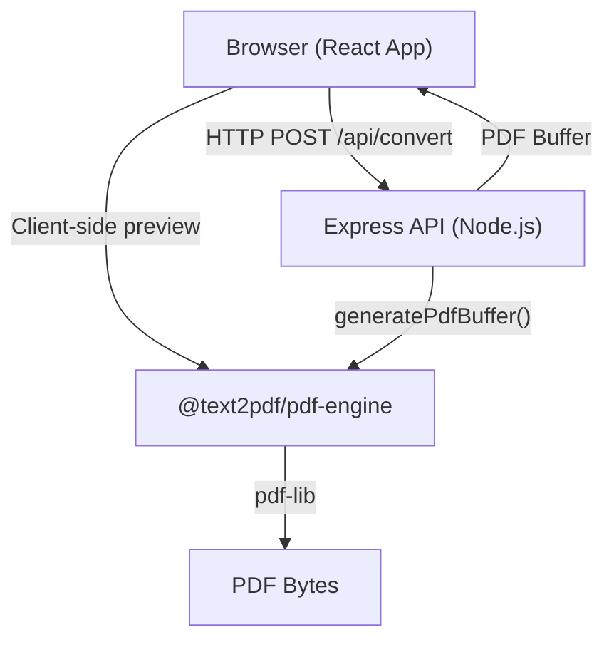

# Architecture

## System Overview



## Monorepo Structure

This is a **pnpm workspace** monorepo with three packages:

```
text-to-pdf-converter/
├── apps/
│   ├── web/          # React + TypeScript + Vite frontend
│   └── api/          # Express + TypeScript backend
└── packages/
    └── pdf-engine/   # Shared PDF generation library (pdf-lib wrapper)
```

### Why a Monorepo?

- **Shared types**: `PdfOptions`, `PdfPayload` are defined once in `@text2pdf/pdf-engine` and used in both frontend and backend.
- **Atomic changes**: A single PR can update the shared library and both consumers simultaneously.
- **Consistent tooling**: One `pnpm install`, one lint/build command.

---

## Frontend Architecture (`apps/web`)

**Stack**: React 19, TypeScript 5.9, Vite 7

**Key design decisions**:

- All PDF preview is generated **client-side** using the shared `@text2pdf/pdf-engine` package — no server round-trip for preview.
- The final download is sent to the **server** (`POST /api/convert`) to ensure reproducible output and offload CPU from the browser.
- Vite proxies `/api/*` to `http://localhost:4000` in development, so the frontend never needs to know the API URL.

**Component structure** (inside `apps/web/src/`):

```
App.tsx          – Root component; owns all state
App.css          – Global dark-mode styles
main.tsx         – React entry point
```

---

## Backend Architecture (`apps/api`)

**Stack**: Express 4, TypeScript 5, multer (file uploads), Zod (validation)

**Key design decisions**:

- **Memory-only**: Uploaded files are stored in `multer.memoryStorage()` and never written to disk.
- **Stateless**: Each request is fully self-contained. No sessions, no persistence.
- **Zod validation**: All incoming `options` are parsed and validated with a strict schema before being passed to the PDF engine.

**Routes**:
| Method | Path | Description |
|--------|------|-------------|
| `GET` | `/api/health` | Health check |
| `GET` | `/api/templates` | List styling presets |
| `POST` | `/api/convert` | Convert text/file to PDF |

---

## PDF Engine (`packages/pdf-engine`)

**Stack**: TypeScript, pdf-lib, tsup (bundler)

Built as both **CJS** (`dist/index.js`) and **ESM** (`dist/index.mjs`) to support both:

- The **backend** (Node.js CommonJS)
- The **frontend** (Vite ESM bundler)

**Core function**: `generatePdfBuffer(payload: PdfPayload): Promise<{ data: Uint8Array, filename: string }>`

**Features**:

- Word-wrapping that respects page margins
- Overflow to new pages automatically
- Optional header with title and page numbers
- Three fonts (Times Roman, Helvetica, Courier)
- Three margin presets and three page sizes

---

## Data Flow

```
User input (text / file)
        │
        ▼
  [Browser validates]
  - Size ≤ 5 MB
  - Type: .txt or .md
  - Length ≤ 50,000 chars
        │
        ├──── Preview (client-side) ────► generatePdfBuffer() ──► <iframe>
        │
        └──── Download (server) ────────► POST /api/convert
                                                │
                                          [API validates]
                                          - Zod schema
                                          - Length limit
                                                │
                                          generatePdfBuffer()
                                                │
                                          PDF bytes ──► response (Content-Disposition: attachment)
```

---

## Technology Choices

| Choice              | Rationale                                                                         |
| ------------------- | --------------------------------------------------------------------------------- |
| **pnpm workspaces** | Fast installs, strict dependency isolation, workspace protocol for local packages |
| **Vite**            | Instant HMR, native ESM dev server, excellent TypeScript support                  |
| **pdf-lib**         | Pure JS/TS, no native binaries, works in both Node.js and browser                 |
| **Zod**             | Runtime type validation that matches TypeScript types                             |
| **multer**          | Battle-tested multipart parser for Express                                        |
| **tsup**            | Zero-config bundler for TypeScript libraries (builds CJS + ESM + types)           |
